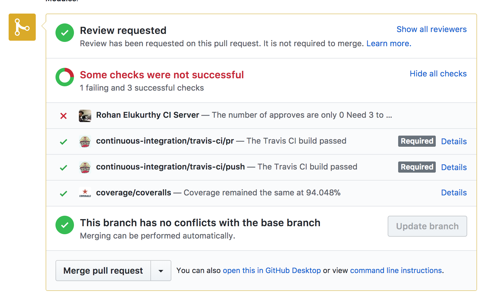
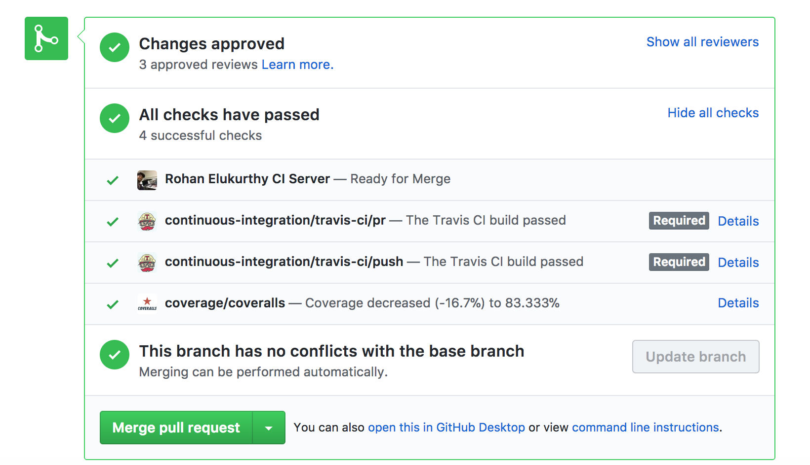

# Github Status API for Pull Request Approval count enforcement

### What problem does this solve
There is no way to enforce a minimum number of Approvals for a pull request before a merge in Github.

This adds a status API to the pull request and will notify when a pull request is ready for a merge. The CI server will recieve all request updates from Github through a webhook. The webhook will then interface with the Github status API and update the status of the pull request as configured. 

<p>
   
</p>

### Usage 

#### Clone the repository
```git clone https://github.com/THEhEROLocker/GithubCI-PullRequest-count-control```<br><br>
Install node(v8.9.4) and then run, ```npm install``` 

#### Generate api key for Github
To communicate with the Github API we will need a Github API token.
<a href="https://github.com/blog/1509-personal-api-tokens">Refer here</a>
This API key can now be added in app.js

Note: The API key should not be shared with anyone.

#### Generate secret key
To secure our webhook we will add a secret key to it. A secret key can be generated in many ways.
You can use the `token_hex` function from the <a href ="https://docs.python.org/3/library/secrets.html">secrets</a> module in Python. This secret key can also be added in app.js

Note: Only Github and your server should have access to this key

#### Running the server
Run ```node app.js```

#### Create an API endpoint
Our endpoint needs to reached through a public facing URL. This can be done locally with the use of a service called <a href="https://ngrok.com/download"> ngrok</a>

After download run ```./ngrok http 4567``` in a seperate terminal or a screen session 

#### Add a new webhook to your Project
From your repository settings go to, Settings > Webhooks > Add webhook

**Payload URL:** use the url provided by ngrok <br>
**Content-type:** select it as application/json <br>
**Secret:** Add the secret key here that was generated above. <br>
**Select Individual events:** Check Pull request, Pull request review and Pull request review comment <br>

And finally, select **Add webhook**

#### Test by making a new pull request

#### Mark the status API as required

